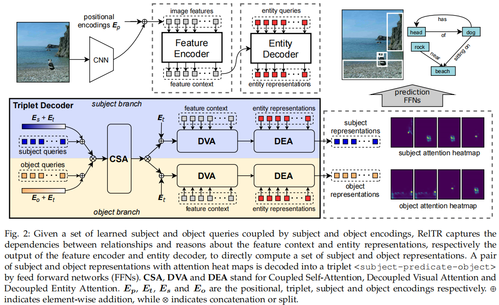
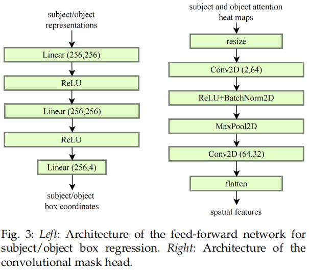
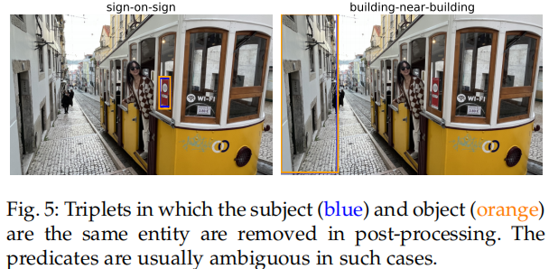
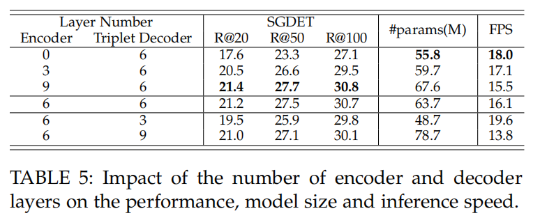
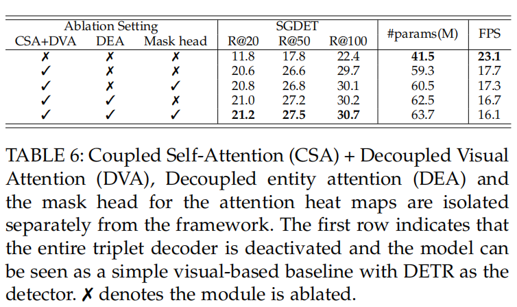
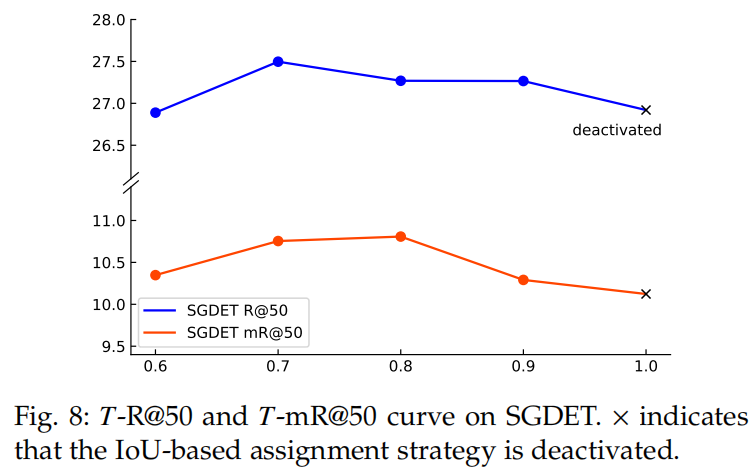
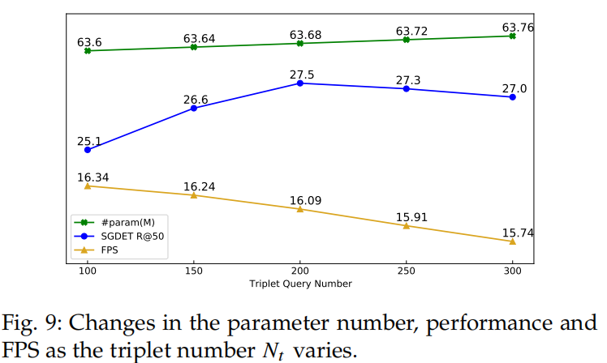
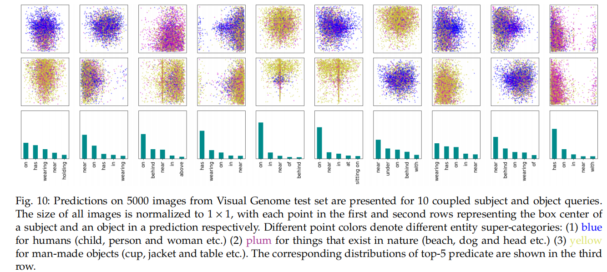
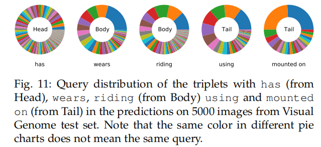

# RelTR: Relation Transformer for Scene Graph Generation

## Motivation

1. 同一场景下的不同物体数量不一致，但只有少部分 relation 有用。
2. 过多依赖特定的主客体本身，而没有考虑到 visual 外观特征。
3. two-stage 会带来参数量过大，训练速度慢，识别速度慢等问题。

## Infomation

- citation 9,10,11,12,13 加入 **语义知识** 来提高性能
- citation 14,15,16,17 是 one-stage 的目标检测
- citation 9,30,42,43 使用残差网络提取全局上下文提高 SGG 的 performance
- citation 42 使用 RNN 迭代多次提高 performance
- citation 44,45,46,47,48 使用基于图结构的模型
- citation 44,49,50 使用图结构的同时加入注意力机制
- citation 34,52,53 使用 Transformer
- citation 2,9,11,54,55 使用 语义知识 作为额外的特征
- citation 11,56,57,58,59,60 使用统计先验信息和知识图谱方法
- FCSGG 是目前为数不多的 one-stage 方法，但达不到 two-stage 的 performance
- SGG - a set prediction problem

## Summary

本篇 work 主要是基于 DETR 这样的结构，SGG 本身就是一个 set prediction 问题，所以参考这样的结构设计出了 one-stage 的 SGG 方法。并且基于这样的结构的同时充分利用了 visual 特征来实现对 triplet 的建模，并且重新设计了 set prediction loss。

## Introduction

参考了 DETR 的设计思想，DETR 是把检测任务看作成一个预测集合的任务。

现阶段，传统的 two-stage 的方法是先通过 oject detector 得到 object proposal，再通过关系分类器根据 subject 和 object 得到 predicate。但这个过程参数量比较大，效率比较低。如果有 $n$ 个 object proposal，那么关系推理网络会有 backbone 提供的错误特征来推理的风险，必须要经过 $\mathcal{O}(n^2)$ 的复杂度来验证。这样的操作会使得关系的选择更倾向于根据 object 的置信度而不是对关系本身。还有一个面临的问题是之前的工作中主要预测的是根据特定的 subject 和 object 预测 predicate，而不是根据 visual 外观的特征。

所以参考 DETR 的设计思想，基于学到的 subject 和 object 的 queries，通过推理整个图像上下文信息和共同出现的实体，可以预测出固定数量的 triplets `<subject, predicate, object>`。

本篇文章主要的贡献：

- 通过从数据中学到的 subject 和 object queries 来 decode visual 外观特征生成稀疏场景图。(One-Stage)
- RelTR 仅基于 visual 外观生成成绩图，与其他模型相比参数量更少，速度更快，性能最好。
- 集合预测 loss 是基于 IOU 的分配策略用来衡量 GT 和 预测的 triplets 之间的 matching 关系。
- 利用 Decoupled Entity Attention 模块，RelTR 可以利用 entity 解码器的检测结果来改进主客体的定位和分类。
- 通过实验，我们发现了每一个模块的作用。

## Model

整体结构如图所示，经过 CNN Backbone 提取 object 的 positional encoding 特征，经过 Feature Encoder 和 Entity Decoder 得到 entity 的特征表示。通过 Triplet Decoder 直接得出 triplet，不用预测 predicate。

### Subject and Object Queries

Subject 和 Object Queries 是两种学到的 Embedding，分别表示为 $Q_s\in\mathbb{R}^{N_t\times d}$ 和 $Q_o\in\mathbb{R}^{N_t\times d}$，分别由 subject 分支和 object 分支得到。这些有 $N_t$ 对 Subject 和 Object Queries 被转换为 $N_t$ 对大小为 $d$ 的 subject 和 object 的特征。

subject querie 和 object querie 实际上并没有连接在一个 query pair 中，因为 triplet decoder 中的 attention 是排列不变的。为了区分不同的 triplets，所以我们引入了可学习的 triplet encodings 特征 $E_t\in\mathbb{R}^{N_t\times d}$

### Coupled Self-Attention

CSA 提取了 $N_t$ 对 triplets 之间的上下文，以及所有 subject 和 object 之间的依赖关系。虽然已经有 triplets encoding 特征 $E_t$，但我们仍然需要与 $E_t$ 具有相同大小的 subject encodings $E_s$ 和 object encodings $E_o$ 来将 `<subject>` 和 `<object>` 的语义概念注入到 CSA 中。$E_s$ 和 $E_o$ 都是在训练中随机初始化和学习的。

:::info

在这一部分分别把 subject 和 triplet 以及 object 和 triplet 进行耦合，使得 encoding 当中包含 triplet 的信息。使得 subject queries 和 object queries 能够包含 triplet 的特征（也就是把 predicate 包含进来）。

CSA 是将 subject, object, triplet 耦合到一起。

:::

$$
Q=K=[Q_s+E_s+E_t,Q_o+E_o+E_t] \\
[Q_s,Q_o]=Att_{CSA}(Q,K,[Q_s,Q_o])
$$
$[,]$ 表示无序的 concat 操作，CSA 的输出被解耦为 $Q_s$ 和 $Q_o$，他们继续被 subject 和 object 分支分别使用。

### Decoupled Visual Attention

:::info

在这一部分是用来提取 visual 特征的。解耦的意思是 subject 和 object 分别独立计算。通过加入 feature context 在计算 subject 和 object 之间的关系时结合 visual 的特征。最后得到的热力图作为谓词分类的特征。

:::

DVA 主要是从特征上下文 $Z$ 中提取视觉特征。解耦意味着 subject 和 object 的计算是相互独立的，与 CSA 不同的是，在 subject 分支中 $Q_s\in\mathbb{R}^{N_t\times d}$ 通过与特征上下文 $Z\in\mathbb{R}^{HW\times d}$ 的交互进行更新。特性上下文与固定位置编码 $E_p\in\mathbb{R}^{HW\times d}$ 结合。更新后的包含视觉特征的 subject 表示为：
$$
Q=Q_s+E_t, K=Z+E_p\\
Q_s=Att_{DVA}^{(sub)}(Q,K,Z)
$$
对于 object 分支也进行同样的操作。在多头注意力中，计算了 $N_t$ 注意力热力图 $M_s∈\mathbb{R}^{N_t\times HW}$。我们采用 reshape 后的热力图作为谓词分类的空间特征。

### Decoupled Entity Attention

:::info

加入 entity 的特征，分别对 subject 和 object 进行计算。

:::

DEA 作为 entity 检测和 triplet 检测之间的桥梁。实体特征 $Q_e∈\mathbb{R}^{N_e\times d}$ 可以提供更高质量的本地化和分类信息，因为它们不存在类似于主题和对象表示之间的语义限制。引入 DEA 的动机是希望 subject 和 object 的特征通过注意力机制从实体表征中学习到更准确的定位和分类信息。$Q_s$ 和 $Q_o$ 最终在一个 triplet 解码器层中更新如下：
$$
Q_s=Att_{DEA}^{(sub)}(Q_s+E_t,Q_e,Q_e)\\
Q_o=Att_{DEA}^{(obj)}(Q_o + E_t,Q_e, Q_e)
$$
$Att_{DEA}^{(sub)}$ 和 $Att_{DEA}^{(obj)}$ 是 subject 和 object 分支中的解耦的 DEA 模块。DEA 的输出由一个前馈网络处理，然后是一个具有残差连接的归一化层。前馈网络（FFN）由两个具有ReLU激活的线性变换层组成。

### Set Prediction Loss for Triplet Detection

集合预测 loss 给 triplet detection 而设计的，通过扩展如下等式中的 entity 检测集合预测 loss，设计了一个 triplet 检测的集合远测 loss。
$$
L_{entity}=\sum_{i=1}^{N_e}[L_{cls}+\mathbb{1}_{\{c^i\not=\phi\}}L_{box}]
$$
我们提出了一个 triplet 集合预测 loss，一个预测出来的集合结构为 $<\hat y_{sub}, \hat c_{prd}, \hat y_{obj}>$ ，其中 $\hat y_{sub}=\{\hat c_{sub}, \hat b_{sub}\}$ 和 $\hat y_{obj}=\{\hat c_{obj}, \hat b_{obj}\}$，GT 为 $<y_{sub},c_{prd},y_{obj}>$。预测的 predicate label 和 object label 分别记为 $\hat c_{sub}, \hat c_{prd}$ 和 $\hat c_{obj}$。预测的 subject 和 object 框坐标记为 $\hat b_{box}$ 和 $\hat b_{obj}$。

当预测 $N_t$ 关系且 $N_t$ 大于图像中 triplets 的数量时，triplets 的 GT 用 $\phi$ `<背景-无关系-背景>` 填充。预测的 triplet 和 GT triplet cost function 用 $c_{tri}$ 表示，$c_{tri}$ 由 subject cost $c_m(\hat y_{sub}, y_{sub})$ 和 object cost $c_m(\hat y_{obj},y_{obj})$  和 predicate cost $c_m(\hat y_{prd}, y_{prd})$ 组成。预测出来的结果用 $\hat y=\{\hat c,\hat b\}$ 表示，$\hat c$ 表示预测出来的类别，$\hat b$ 表示预测出来的框坐标，$\hat p$ 表示类别的概率。GT 用 $y=\{c, b\}$ 表示，包含 GT 类别 $c$ 和 GT 框坐标 $b$。对于谓词而言，我们仅预测 $\hat c_{prd}$ 和 $c_{prd}$。

subject 和 object 的 cost 由预测的类别概率和预测的边界框决定，而 predicate cost 仅由预测的谓词类别概率决定。我们将 $𝑐$  的预测概率定义为 $\hat p(c)$。我们采用[66]中的类别 cost 函数，可以表述为：
$$
c^+_{cls}=(\hat c, c)=\alpha\cdot(1-\hat p(c))^\gamma\cdot(-\log(\hat p(c)+\epsilon)) \\
c^-_{cls}=(\hat c, c)=(1-\alpha)\cdot\hat p(c)^\gamma\cdot(-\log(1-\hat p(c)+\epsilon)) \\
c_{cls}(\hat c, c) = c^+_{cls}(\hat c, c)-c^-_{cls}(\hat c, c)
$$
其中，$\alpha, \gamma$ 和 $\epsilon$ 分别设置为 0.25, 2 和 $10^{-8}$。主体和对象的 box cost 使用 $L_1$ 损失和 IoU 损失来计算：
$$
c_{box}(\hat b, b)  = 5L_1(\hat b, b)+2L_{GIOU}(\hat b, b)
$$
subject 和 object 的 cost function 表示为：
$$
c_m(\hat y, y)=c_{cls}(\hat c, c) + \mathbb{1}_{\{b\in y\}}c_{box}(\hat b, b)
$$
其中，$b\in y$ 表示地面真相包括方框坐标（仅用于 subject/object cost）。预测的 triplets 和 GT triplets 之间的 cost 计算为：
$$
c_{tri}=c_m(\hat y_{sub}, y_{sub})+c_m(\hat y_{obj}, y_{obj})+c_m(\hat y_{prd}, y_{prd})
$$
给定 triplet 代价矩阵 $C_{t𝑟𝑖}$，执行匈牙利算法进行二部匹配，并将每个 GT triplets 分配给一个预测的结果。然而， `<background-no relation-background>` 这个关系被分配给所有与 GT triplet 不匹配的预测结果。经过多次训练，RelTR 可能以四种可能的方式输出 triplet proposal，如图 4 所示。将 Proposal A 分配给 GT 和 `<background-no relation-background>` 分配给 Proposal B 是两个明确的情况。对于 Proposal C，由于对象预测较差，不应将 `<background>`分配给受试者。此外，`<backround>` 不应该被分配给 Proposal D 的主题和对象，因为有一个更好的 Proposal A。

为了解决这个问题，我们集成一个基于 IoU 分配策略设置预测损失：对于预测出来的 triplet，如果预测 subject 或 object 标签是正确的，和预测的 box 和 GT box 大于或等于阈值 $𝑇$，损失函数不计算损失的 subject 或 object。triplet 检测的集合预测损失的公式为：
$$
L_{sub}=\sum_{i=1}^{N_t}\Theta[L_{cls}+\mathbb{1}_{\{c_{sub}^i\not=\phi\}}L_{box}] \\
L_{obj}=\sum_{i=1}^{N_t}\Theta[L_{cls}+\mathbb{1}_{\{c_{obj}^i\not=\phi\}}L_{box}] \\
L_{triplet}=L_{sub}+L_{obj}+L_{cls}^{prd}
$$
其中，$𝐿^{𝑝𝑟d}_{𝑐𝑙s}$ 是谓词分类的交叉熵损失。当将 `<background>` 分配给 subject/object，但标签预测正确，并且方框与GT $IoU\ge 𝑇$ 重叠，$Θ$ 为 0，在其他情况下，$Θ$ 为 1。总损失函数的计算方法为：
$$
L_{total}=L_{entity}+L_{triplet}
$$

### Post-Processing

不同于将 $N$ 个 entity 组成 $N(N−1)$ 主体-对象对的 two-stage 方法不同，我们的方法同时检测 subject 和 object，同时预测固定数量的 triplets。这导致我们的方法忽略了主体和对象不能是同一个实体的约束。造成的结果是我们的模型有时输出一种 triplets，其中 subject 和 object 是同一个实体，带有一个歧义的谓词（例如见图 5）。在后处理中，如果 subject 和 object 是相同的实体（由标签和边界框的IoU决定），则该 triplets 将被删除。

## Experiments

### Detail

我们在 VG 和 Open Image V6 的实验中采用了相同的超参数。

我们在 8 个 RTX 2080Ti GPU上从头训练 RelTR 的 150 个 epoch，AdamW [71] 将 batchsize 设置为每个GPU 2，weight decay 为10−4， clipping the gradient norm > 0.1。

Transformer 和 ResNet - 50 主干的初始学习速率分别设置为 $10^{-4}$ 和 $10^{−5}$，在 100 个 epoch 后，学习率下降 0.1。

在训练中，我们也像[18]，[66]那样，对 triplet 解码器使用  auxiliary losses [72]。默认情况下，RelTR 有 6 个编码器层和 6 个 triplet 解码器层。

triplet 解码器层数和 entity 解码器层数设置为相同。在我们的模型中，8 个头的多头注意模块训练 dropout 为 0.1。

对于所有的实验，模型维度 $d$ 被设置为 256。

如果没有特别说明，entity queries $N_e$ 和 coupled queries $N_t$ 的数量分别设置为 100 和 200，而 triplet assignment 中的 IoU 阈值为 0.7。为了进行公平比较，所有报告的 SGG 模型的推理速度（FPS）在相同硬件配置的 RTX 2080 Ti 上进行评估。

### Ablation Studies

消融实验主要从以下几个方面出发：

- 网络层数

  

- 模块有效性

  

- 集合预测 loss 的阈值

  

### Analyisis on Subject and Object Queries

与在 NMS 之后输出N对象建议，然后标记 $N(N−1)$ 谓词的 two-stage 方法不同，RelTR 通过 $N_t$ 与图像交互的  subject 和 object queries 直接预测 $N_t$ 对 triplets。我们使用不同的 $N_t$ 在 VG 数据集上训练该模型。图 9 显示，随着耦合的 subject 和 object 查询的数量线性增加，模型的参数线性增加，而推理速度线性降低。然而，性能呈非线性变化，当 $N_t= 200$ 时，获得最佳性能。太多的查询会生成许多不正确的 triplet proposal 会取代 recall list 中的正确的 proposal。

为了探索 RelTR 如何通过 coupled subject 和 object queries 来推断 triplets，我们从 VG 测试集的 5000 张图像的随机样本中收集预测。我们对 200 个耦合查询中的 10 个的预测可视化。图 10 显示了 subject 和 object 的空间和类别分布，以及 10 个耦合的主题和对象查询的 5000 个预测中前 5 个谓词的类分布。它证明了不同的耦合查询从训练数据中学习不同的模式，并在推理时注意不同区域中不同类别的 triplets。

> 为什么拿出了三种颜色分成了这几个大类？

根据图 11 所示，has 有关的 queries 分布更加平滑。这表明，所有的查询都能够预测高频关系。对于 body 和 tail 中的谓词，有一些查询特别擅长检测它们。例如，21% 的带有谓词 `wears` 的 triplet 被 Query 115 预测，而有一半的带有 `mounted on` 的 triplet 被 Query 107 和 105 预测。

### Qulitative Results

图 14 为 VG 数据集的场景图生成（SGDET）的定性结果。虽然其他一些建议也很有意义，但由于图 14 中的空间限制，我们只展示了 9 个置信度得分最高的关系和生成的场景图。蓝色的框是 subject 框，橙色的框是 object 框。注意力分数以与方框相同的颜色显示。subject 和 object 注意力的重叠的部分用白色表示。这两幅图像的 GT 标签如图 12 所示。为了简洁起见，我们只显示出现在带标签 triplet 中的实体的边界框。

对于第一个图像（与汽车和建筑），我们可以假设 9 个输出三联体都是正确的。`<car-in front of-building>` 表明，RelTR可以在一定程度上理解二维图像的空间关系（`in front of` 不是 VG 高频出现的谓词）。然而，第一张图像的 R@9 只有 5/12 = 41.7，因为更偏向 GT triplet。这种现象在第二张图片中更为明显（包括女人和电脑）。请注意，在所使用的 VG-150-split [42]中，没有 computer，而只有 laptop。来自 RelTR 的 9 个预测中有 6 个可以被认为是有效的，而 R@9 由于标签偏好而为 0。有时 RelTR 会输出一些重复的 triplets，比如在第二张图片中，`<woman-wearing-jean>` 和 `<woman-looking at-laptop>`。除了输出结果之外，RelTR 还显示了输出关系的感兴趣区域，使模型的行为更容易解释。

Open Image V6 的 SGDET 定性结果如图13所示。与 VG 注释中的密集 triplets 不同，Open Image V6 中的每张图像平均被标记为2.8 个 triplet。因此，我们只显示了对每张图像的预测中最自信的 triplets。
