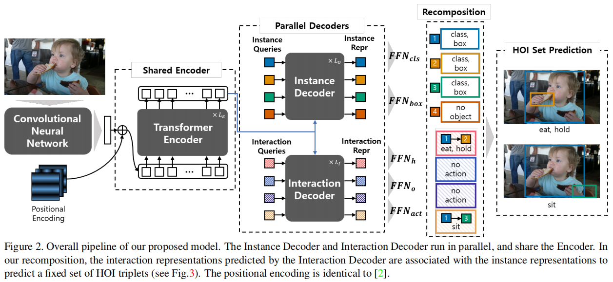

# HOTR: End-to-End Human-Object Interaction Detection with Transformers

## Motivation

1. 大部分方法都是需要单独检测出人和 object 之后再对每一对关系进行预测。
2. 单独预测出人和 object 之后再检测关系比较费时费算力，不够快。

## Summary

本篇 paper 主要使用 Transformer 进行 HOI 检测。通过重新设计 DETR 的方式实现不需要通过一一匹配的方式来得到正确的 triplet，通过一个 encoder 和 两个 decoder （instance decoder 和 interaction decoder）实现对 triplet 的预测。并且提出了一种 HO Pointer 的方式来匹配。

## Introduction

- Sequential HOI Detectors:

  - InteractNet：扩展了现有的目标检测器，引入了一个动作特定的密度图，基于以人为中心的外观来定位目标对象，并结合来自单个盒子的特征来预测交互。
  - iCAN：一个以实例为中心的注意模块，它局部 object / 人 中提取与特征互补的上下文特征。
  - No-Frills HOI detection：提出了一种仅使用简单的多层感知器的训练和推理HOI检测管道。
  - Graph-based approaches have proposed frameworks that can explicitly represent HOI structures with graphs [24, 26, 4, 28, 21]：基于图的方法提出了可以用图[24,26,4,28,21]显式地表示 HOI 结构的框架。
  - Deep Contextual Attention：提出了一种仅使用简单的多层感知器的训练和推理HOI检测管道。基于图的方法提出了可以用图[24,26,4,28,21]显式地表示HOI结构的框架。
  - [28]：提出了一种异构图网络，将人和对象建模为不同类型的节点
  - linguistic priors [23, 31, 17, 4, 1, 32, 20]
  - human pose information [15, 33, 18, 9, 27, 33] 

- Parallel HOI Detectors:

  - 这些工作直接定位了与交互点[30,19]或联合盒[12]的交互，用简单的基于启发式的距离或信息信息匹配取代了用于交互预测的单独神经网络。由于它们可以与现有的对象检测器并行化，因此它们具有快速的推理时间。
  - 由于它们可以与现有的对象检测器并行化，因此它们具有快速的推理时间。然而，这些工作的局限性在于，因为它们需要一个手工制作的后处理阶段来将局部交互与目标检测结果联系起来。这个后处理步骤分为：
    - 需要手动搜索阈值
    - 生成额外的时间复杂度，以匹配每个对象对与本地化的交互（5∼9ms）。

- 受到 DETR 的启发

  DETR [2]最近被提出，以消除在目标检测中需要许多手工设计的组件，同时展示了良好的性能。DETR 在通过解码器的一次通道中推断出一组固定大小的 $N$ 个预测，其中 $N$ 被设置为明显大于图像中的典型对象数量。DETR 的主要损失产生了预测对象和地面真实对象之间的最优二部匹配。随后，对目标特定的损失（针对类别和边界框）进行优化。

## Methods

本文的目的是预测一组 <human, object, interaction> 的 triplets，同时以端到端的方式考虑这些 triplets 之间的内在语义关系。

为了实现这一目标，我们将 HOI 检测表示为集合预测的形式。在本节中，我们首先讨论将目标检测[2]的 triplet 预测结构直接扩展到 HOI 检测的问题。然后，我们提出了我们的架构 HOTR，它并行地预测了一组 object，并将交互中的人和对象关联起来，而 Transformer 中的自注意力则模拟了交互之间的关系。最后，我们给出了我们的模型的训练细节，包括匈牙利匹配的HOI检测和我们的损失函数。

### Architecture

HOTR的总体结构如图 2 所示。我们的架构的特点是一个 Transformer encoder-decoder 结构，带有一个共享的编码器和两个并行解码器（即，instance 解码器和 interaction 解码器）。这两个解码器的结果与使用我们提出的 HO Pointer 来生成最终的 HOI triplets 相关联。

- **Transformer Encoder-Decoder architecture**

  :::tip

  这里的交互表示为谓词动作。

  :::

  与DETR [2]类似，全局上下文是由主干CNN和一个共享编码器从输入图像中提取出来的。然后，将两组位置嵌入（即实例查询和交互查询）输入到两个并行解码器（即图2中的 instance 解码器和 interaction 解码器）中。

  instance 解码器将实例查询转换为用于目标检测的 instance 特征，而 interaction 解码器将 interaction queries 转换为用于交互检测的 interaction 特征。

  我们将前馈网络（FFNs）应用于 instance 特征，得到了一个 Human Pointer，一个 Object Pointer 和 interaction type，见图3。换句话说，instance 表征过使用 Human Pointer 和 Object Pointer（HO指针）指向相关的 instance 表示来定位人的区域和 object 的区域，而不是直接回归 bbox。

  与直接回归方法相比，我们的架构有几个优点。我们发现，当一个对象参与多个交互时，直接回归边界框会出现问题。在直接回归方法中，相同 object 位置在不同的交互中是不同的。我们的体系结构通过使用单独的 instance 和interaction 表征，并使用 HO Pointer 关联它们来解决这个问题。此外，我们的架构允许更有效地学习 object 的位置，而不需要为每个交互冗余地学习位置。请注意，我们的实验表明，我们的共享编码器比两个单独的编码器更有效地学习 HO Pointer

- **HO Pointers**

  图 3 说明了 HO 指针如何将来自 instance 解码器和 interaction 解码器的并行预测关联起来的概念性概述。HO指针（即，Human Pointer 和 Object Pointer）包含交互中的人和 object 的相应实例表示的索引。

  

  在 interaction decoder 转换 $K$ 个 interaction queries 成 $K$ 个 interaction 表征之后，interaction 表征 $z_i$ 传入到两个 FFN 中，分别表示为：$\text{FFN}_h:\mathbb{R}^d\rarr\mathbb{R}^d,\text{FFN}_o:\mathbb{R}^d\rarr\mathbb{R}^d$。为了得到向量 $v_i^h$ 和 $v_i^o$。也就是 $v_i^h=\text{FFN}_h(z_i)$ 和 $v_i^h=\text{FFN}_o(z_i)$。最后得到相似度得分最高的 instance 表征的索引 $\hat c_i^h$ 和 $\hat c_i^o$。
  $$
  \hat c^h_i=\mathop{\text {argmax}}\limits_{j}(\text{sim}(v_i^h,\mu_j)) \\
  \hat c^o_i=\mathop{\text {argmax}}\limits_{j}(\text{sim}(v_i^o,\mu_j))
  $$
  其中 $\mu_j$ 是第 $j$ 个 instance 表征和 $\text{sim}(u,v)= u^Tv/ (||u||\cdot||v||)$。

- **Recomposition for HOI Set Prediction**

  从前面的步骤中，我们现在有了以下内容：

  1. $N$ 个实例表示 $\mu$。

  2. $K$ 个 instance 表征 $z$ 和它们的HO Pointer $\hat c^h$ 和 $\hat c^o$。给定 $\gamma$ 交互类，我们的重组方法是应用 FFN 进行bbox 回归和 interaction 分类，分别为 $\text{FFN}_{box}: \mathbb{R}^d\rarr\mathbb{R}^4$ 和 $\text{FFN}_{act}: \mathbb{R}^d\rarr \mathbb{R}^\gamma$。然后，得到第 $i$ 个 interaction表示 $z_i$ 的最终 HOI 预测的结果。
     $$
     \hat b^h_i = \text{FFN}_{box}(\mu_{\hat c^h_i}) \in \mathbb R^4 ,\\
     \hat b^o_i =\text{FFN}_{box}(\mu_{\hat c^o_i}) \in \mathbb R^4, \\
     \hat a_i = \text{FFN}_{act}(z_i) \in \mathbb R^{\gamma}.
     $$
     由我们的 HOTR 最终预测结果的 HOI 是 $K$ 个 triplets 的集合，$\left\{\left \langle \hat b^h_i，\hat b^o_i，\hat a_i\right \rangle \right \}^K_{i=1}$。

- **Complexity & Inference time**

  以往的并行方法已经用快速匹配的 triplets（将神经网络 interaction 区域与基于距离 [30] 或 IoU[12] 的相应的 human 区域和 object 区域关联起来）取代了昂贵的成对神经网络推理。HOTR 通过将 $K$ 个 interaction 与 $N$ 个 instance 关联起来，进一步减少了目标检测后的推理时间，从而降低了时间复杂度 $\mathcal{O}(KN)$。通过消除之前的一阶段 HOI 检测器的后处理阶段，包括 interaction 区域的 NMS 和 triplet 匹配，HOTR 减少了 4∼8 ms 的推理时间，同时显示出性能的改善。

### Training HOTR

在本节中，我们将解释 HOTR 训练的细节。首先引入匈牙利匹配的代价矩阵，用于通过重组得到的 GT HOI triplet 和预测得到的 HOI 集合之间的唯一匹配。然后，利用匹配结果，我们定义了HO Pointer 的损失和最终的训练损失。

- **Hungarian Matching for HOI Detection**

  HOTR 预测了 $K$ 个 HOI triplet，它们包括人的 bbox、object 框和 $a$ 动作类型的二进制分类。每个预测都捕获一个独特的 `<human, object>` 一个或多个 interactions。$K$ 被设置为大于图像中 interaction 对的类别数量。我们从基本代价函数开始，它定义了预测和 GT HOI triplet 之间的最优二部匹配，然后展示我们如何修改交互表示的匹配代价。

  设 $\mathcal{Y}$ 表示 GT HOI triplet 的集合，而 $\mathcal{\hat Y}=\{\hat y_i\}^K_{i=1}$ 作为 $K$ 个预测的集合。由于 $K$ 大于图像中唯一交互对的数量，我们也认为 $\mathcal{Y}$ 也是一组大小为 $K$ 的填充 $\phi$（表示没有交互）。为了找到这两个集合之间的二部匹配，我们寻找 $K$ 个元素 $\sigma∈\mathcal{S}_K$ 的排列：
  $$
  \hat\sigma = \mathop{\text{argmin}}\limits_{\sigma\in \mathcal{S}_K}\sum^K_i\mathcal{C}_{match}(y_i, \hat yˆ_{\sigma(i)}),
  $$
  其中，$\mathcal C_{match}$ 是 GT $y_i$ 和具有索引 $\sigma(i)$ 的预测之间的成对匹配代价。但是，由于 $y_i$ 是 $<\text{hbox},\text{obox},\text{action}>$ 的形式，而 $\hat y_{\sigma(i)}$ 是 $<\text{hidx},\text{oidx},\text{action}>$ 的形式，所以我们需要修改成本函数来计算匹配成本。

  设 $Φ: \text{idx}\rarr \text{box}$ 是一个映射函数，从GT $<\text{hidx}, \text{oidx}>$ 到 GT $<\text{hbox}, \text{obox}>$。使用逆映射 $Φ^{−1}:\text{box}\rarr\text{idx}$，我们从 GT box 中得到GT idx。

  设 $M\in \mathcal{R}^{d\times N}$ 是一组规范化的 instance 表征 $\mu’=\mu/||\mu||\in\mathbb{R}^d$，即 $M=[\mu'_1,\cdots ,\mu'_N]$。我们计算 $\hat P^h\in\mathbb{R}^{K\times N}$，这是对(1)中的 Human Pointer 的 softmax 预测集合，给定为：
  $$
  \hat P^h=||^K_{i=1}\text{softmax}((\bar v^h_i)^TM)
  $$
  其中，$||^K_{i=1}$表示行向量的垂直方向 stack，以及 $\bar v_i^h=v_i^h/||v_i^h||$。$\hat P_o$ 也是类似的定义。

  给定 GT $y_i=(b^h_i,b_i^o,a_i),\hat P^h$ 和 $\hat P^o$，我们通过 $c_i^h=\Phi^{−1}(b^h_i)$ 和 $c^o_i=\Phi^{−1}(b^o_i)$ 转换为索引，并计算我们的匹配代价函数写为：
  $$
  \mathcal{C}_{match}(y_i, \hat y_{\sigma(i)}) = −α·\mathbb 1_{\{a_i\not=\varnothing\}}\hat P^h[\sigma(i), c^h_i] \\
  \mathbb 1_{\{a_i\not=\varnothing\}}\hat P^o[\sigma(i), c^o_i] \\
  +\mathbb 1_{\{a_i\not=\varnothing\}}\mathcal{\hat L}_{act}(a_i, \hat a_{\sigma(i)})
  $$
  其中，$\hat P[i,j]$ 表示第 $i$ 行和第 $j$ 列处的元素，而 $\hat a_{\sigma(i)}$为预测的动作。动作匹配成本计算为 $\mathcal{L}_{act}(a_i,\hat a_{\sigma(i)})=\text{BCELoss}(a_i,\hat a_{\sigma(i)})$。将 $\alpha$ 和 $\beta$ 设置为常数，以平衡指数预测和行动分类的成本函数的不同尺度。

- **Final Set Prediction Loss for HOTR.**

  然后我们计算上面所有匹配的对的匈牙利损失，其中 HOI triplet 的损失有位置损失和动作分类损失为：
  $$
  \mathcal{L}_H =\sum^K_{i=1}\mathcal{L}_{loc}(c^h_i, c_i^o, z_{\sigma(i)}) + \mathcal{L}_{act}(a_i, \hat a_{\sigma(i)})
  $$
  位置损失 $\mathcal{L}_{loc}(c^h_i, c_i^o, z_{\sigma(i)})$ 记为：
  $$
  \mathcal{L}_{loc} = − log\frac{\exp(\text{sim}(\text{FFN}_h(z_{\sigma(i)}), \mu_{c^h_i})/\tau)}{\sum^N_{k=1}\exp(\text{sim}(\text{FFN}_h(z_{\sigma(i)}), \mu_k)/\tau )} \\ − log\frac{\exp(\text{sim}(\text{FFN}_o(z_{\sigma(i)}),\mu_{c^o_i}/\tau )}{\sum^N_{k=1}\exp(\text{sim}(\text{FFN}_o(z_{\sigma(i)}), \mu_k)/\tau )}
  $$
  其中，$\tau$ 是控制损失函数的平滑度的温度。我们通过经验发现，$τ = 0.1$ 是我们实验的最佳值。
  
- **Defining No-Interaction with HOTR**

- **Implementation Details**

  我们用 AdamW [22]来训练 HOTR。我们将 Transformer 的初始学习速率设置为 $10^{−4}$，权重衰减设置为 $10^{−4}$。所有 Transformer 的权重都用 Xavier init [7]初始化。为了与 baseline 进行公平的评估，backbone, encoder 和 instance 解码器在 MS-COCO中 进行了预训练，并在训练期间进行了冻结。我们使用 DETR [2] 中的比例放大，调整输入图像的大小，使最短的边至少为 480 像素，最多为 800 像素，而最长的边最多为 1333 像素。

## Experiments

在本节中，我们将演示我们的模型在 HOI 检测中的有效性。我们首先描述了我们用作 baseline 的两个公共数据集： V-COCO 和 HICO-DET。接下来，我们展示了 HOTR 通过在 mAP 和推理时间上实现了最先进的性能，成功地捕获了 HOI triplet。然后，我们提供了对 HOTR 体系结构的详细消融研究。

## Conclusion

在本文中，我们提出了第一个基于 Transformer 的人机交互问题中的集合预测方法 HOTR。HOTR 的集合预测方法消除了以前的 HOI 检测器的手工制作的后处理步骤，同时能够建模交互之间的相关性。

我们提出了各种HOTR的训练和推理技术：使用并行解码器进行HOI分解，基于相似性的重组层进行推理，以及交互抑制。我们开发了一种新的基于集的 HOI 检测匹配方法，它将交互表示与指向实例表示关联起来。

我们的模型在HOI检测的两个数据集上取得了最先进的性能： V-COCO和HICO-DET的性能，与以前的并行HOI探测器有显著的优势。HOTR在HOI检测推理时间下的两个基准数据集上取得了最先进的性能，比以前的并行HOI探测器（5∼9ms）要快得多。