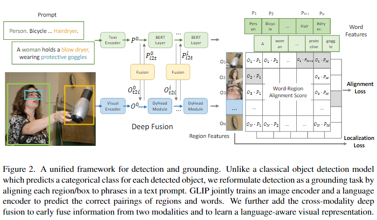

# Grounded Language-Image Pre-training

## Abstract

学习对象级、语言感知和语义丰富的视觉表示。GLIP 将目标检测和 phrase grounding 统一起来进行预训练。好处在于：

1. 它允许 GLIP 从检测和接地数据中学习以改进任务并引导良好的接地模型；
2. GLIP 可以通过自我训练的方式生成接地框来利用海量的图像-文本对，使学习的表示语义丰富。

学习的表征对各种对象级识别任务具有很强的零样本和少样本可迁移性，适合用于处理 zero-shot 和 few-shot 任务。实验结果也表明我们效果最好。

## Motivation

提高模型的 zero-shot 和 few-shot 能力，利用目前的 pre-trained 大模型来实现。

## Method how to use?

目标检测任务中的对每个区域进行分类的任务转换成将每个区域对齐到文本 prompt 中的 c 个短语，将视觉检测定义为 grounding task。输入一些 image-text pair，将其融合后使得图像上的物体和文本描述中的 prompt 对应的单词对齐来完成分类的任务。（带检测模块的 CLIP）

1. 定义好新的范式以及如何利用 prompt 作为特征信息的一部分。

2. 设计好对应的 image encoder 和 text encoder。本文使用的 image encoder 为 DyHead (Dynamic Head: Unifying Object Detection Heads with Attentions)，使用的 text encoder 为 BERT。

3. 除此之外还要设计一个 cross-modality multi-head attention module (X-MHA)。每个头部通过关注另一个模态来计算一个模态的上下文向量。

4. 最后再准备大量数据进行 pre-training 的训练。

5. 迁移到其他 benchmark 进行验证训练。

## Heuristic Thinking

`GLIP 统一了 phrase grounding 和目标检测任务，因为目标检测可以被视为上下文无关的 phrase grounding，而 phrase grounding 可以被视为上下文化的目标检测任务。`
是否能够利用 phrase grounding 增强其视觉的语义丰富度？（增强 context）

是否可以通过 prompt 提示出 visual feature (ROI feature, union feature, etc.) 中的关系呢，通过设计 prompt？

之前的工作中已经有用 glove 使用其 phrase feature 来提高 zero-shot 的能力。是否可以说明 nlp 当中的模型天生具备比较强的 zero-shot 学习能力呢？