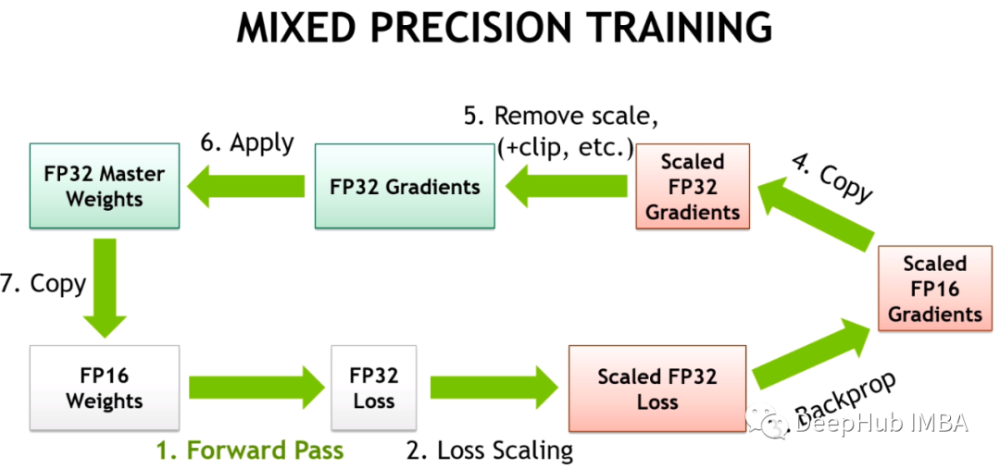

# Mixed Precision Training

混合精度已经成为训练大型深度学习模型的必要条件，但也带来了许多挑战。将模型参数和梯度转换为较低精度数据类型（如FP16）可以加快训练速度，但也会带来数值稳定性的问题。使用进行FP16 训练梯度更容易溢出或不足，导致优化器计算不精确，以及产生累加器超出数据类型范围的等问题。混合精度训练流程如下：

在早期训练阶段了解模型的内部状态可以判断模型在后期训练中是否容易出现不稳定是非常好的办法，如果能够在训练的头几个小时就能识别出梯度不稳定性，可以帮助我们提升很大的效率。

## 解决方案

### 训练不稳定

### 梯度缩放

