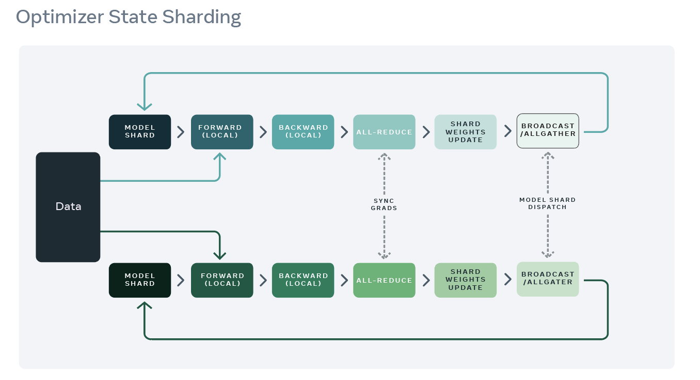
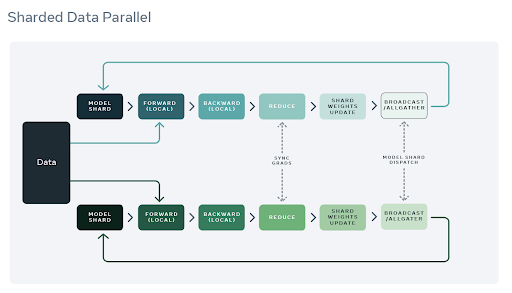
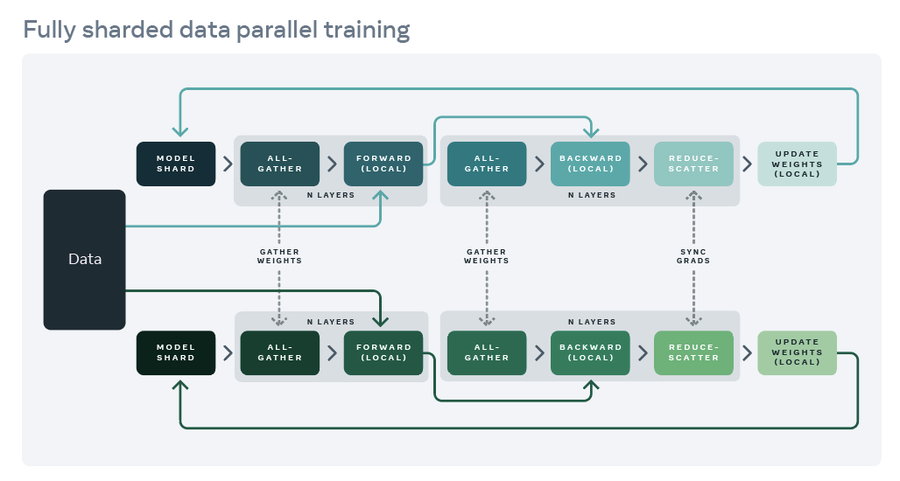

# ZeRO 优化算法

## Intro

由微软提出的 ZeRO [https://arxiv.org/pdf/1910.02054.pdf](https://link.zhihu.com/?target=https%3A//arxiv.org/pdf/1910.02054.pdf) 针对数据并行的场景，在Deepspeed与fairscale发扬光大。ZeRO有三个不同级别，对Model States进行不同程度的分割：

- ZeRO-1 : Optimizer States Sharding
- ZeRO-2 : Optimizer States & Gradients Sharding
- ZeRO-3 : Optimizer States & Gradients & Parameters Sharding

### ZERO-1

ZeRO-1没有即没有将模型本身进行分，也没有将Gradient进行分片，而是只将优化器进行分片。

1. 训练过程与DDP类似。forward过程由每个rank的GPU独自完整的完成，然后进行backward过程。在backward过程中，梯度通过allReduce进行同步。
2. Optimizer state 使用贪心策略基于参数量进行分片，以此确保每个rank几乎拥有相同大小的优化器内存。
3. 每个rank只负责更新当前优化器分片的部分，由于每个rank只有分片的优化器state，所以当前rank忽略其余的state。
4. 在更新过后，通过广播或者allGather的方式确保所有的rank都收到最新更新过后的模型参数。

- ZeRO-1 非常适合使用类似Adam进行优化的模型训练，因为Adam拥有额外的参数m（momentum）与v（variance），特别是FP16混合精度训练。
- ZeRO-1 不适合使用SGD类似的优化器进行模型训练，因为SGD只有较少的参数内存，并且由于需要更新模型参数，导致额外的通讯成本。
- 只是解决了Optimizer state的冗余。s

## ZERO-2

为了减少梯度Gradient冗余以此进一步节省内存，ZeRO-2提出gradient sharding，在FairScale里称之为Sharded Data Parallel（SDP）。

相比与ZeRO-1, ZeRO-2除了对optimizer state进行切分，还对Gradient进行了切分。

1. 像ZeRO-1 一样将optimizer的参数进行分片，并安排在不同的rank上。
2. 在backward过程中，**gradients被reduce操作到对应的rank上，取代了all-reduce**，以此减少了通讯开销。
3. 每个rank独自更新各自负责的参数。
4. 在更新操作之后，广播或allGather保证所有的ranks接受到更新后的参数。

## ZERO-3

为了进一步节省更多的内存，ZeRO-3提出进行模型参数的分片。类似以上两种分片方式，ranks仅负责模型参数的切片。可以进行参数切片的原因主要有以下两点：

1. **AllReduce操作可以被拆分为Reduce与allgather操作的结合**。
2. 模型的每一层拥有该层的完整参数，并且整个层能够直接被一个GPU装下。所以计算前向的时候，除了当前rank需要的层之外，其余的层的参数可以抛弃

基于以上两点，FSDP 的过程如下：

1. 仅当要计算一个特定的层的 forward 过程之前，使用 AllGather 获取模型该层所需的前置的层的参数。
2. 计算前向。结束后释放掉不属于该rank分片的层的参数。
3. 与1类似，仅当要计算一个特定的层的 backward 过程之前，使用 AllGather 获取该层所需要的层之前过程的参数。
4. 计算后向。结束后释放掉不属于该 rank 分片的层的参数。
5. 使用 Reduce 对当前分片的参数的梯度进行累加。
6. 让每个 rank 根据聚合的梯度，独立更新参数。

## Reference

- [Efficient Memory management | FairScale documentation](https://fairscale.readthedocs.io/en/latest/deep_dive/oss_sdp_fsdp.html)
- [数据并行Deep-dive: 从DP 到 Fully Sharded Data Parallel （FSDP）完全分片数据并行 - 知乎 (zhihu.com)](https://zhuanlan.zhihu.com/p/485208899)
